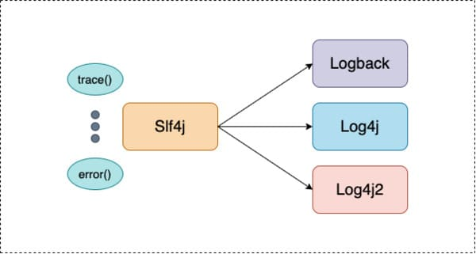
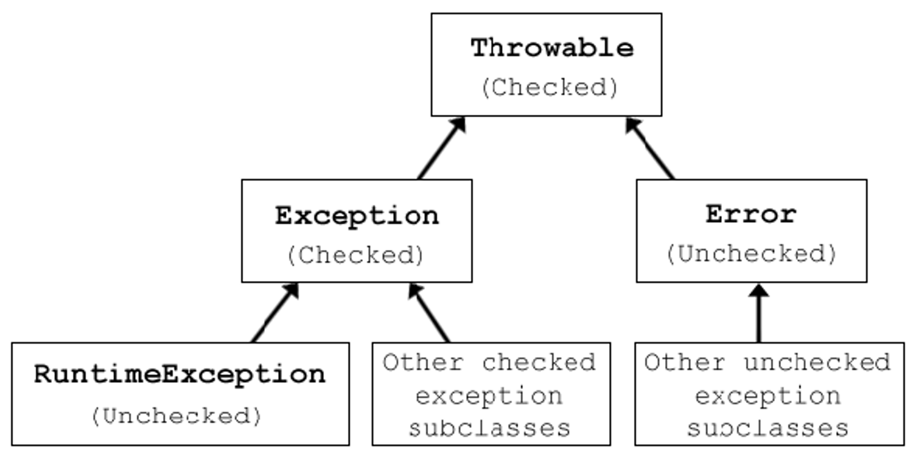

# ELK-Study

## 로그

1. 기본 원칙

- 트러블 슈팅 목적성: 장애 발생 시 **원인을 파악하고 재현할 수 있는 충분한 단서**(Context)가 되어야 한다. (서비스 특성에 따라 기준 상이)
- 중복 로깅 지양: 노이즈(Noise)를 줄이고 스토리지 비용을 절약하기 위해 **꼭 필요한 구간**에서만 남긴다.
  - `Controller`에서 Request Body를 남겼다면, `Service`나 `Repository` 계층에서 동일한 데이터를 반복해서 남기지 않는다.

2. 범용적으로 남기면 좋은 로그

- 요청/응답 (Request/Response) 로그: API 호출 URL, HTTP Method, 파라미터, 응답 시간(Latency), 응답 상태 코드(Status Code).
- 오류/예외 (Error/Exception) 로그: 에러 메시지뿐만 아니라 Stack Trace 전체, **에러 발생 시점의 파라미터 및 상태** 값.
- 보안 로그: 로그인 성공/실패, 권한 인가 실패(401/403), 주요 설정 변경 이력.
- 배치/스케줄링 로그: 배치 작업의 **시작/종료 시간, 처리 건수, 성공/실패 여부**

3. 참고

- 추적성 (Traceability) 확보: 수많은 요청이 섞이는 서버 환경에서는 단일 요청의 흐름을 묶어볼 수 있는 **식별자가 필수**
- 사용자 식별자: 로그인한 사용자라면 User ID나 Session ID를 포함하여 **'누가' 발생시킨 로그인지 식별**

## Logback

- **정의**: 현재 가장 널리 쓰이는 자바 기반 로깅 프레임워크이다.
- `spring-boot-starter`에 **기본 포함**되어 있으며, 별도 설정 없이도 바로 사용 가능
- **주요 특징**: `Log4j` 대비 월등한 속도와 메모리 사용량이 적다
  - 설정 파일 변경 시 서버 재시작 없이 자동 리로딩 지원.
- **사용법**: `@Slf4j` 어노테이션 선언을 통해 **객체 생성 없이 즉시 사용 가능**하다.
  - `PSA(Portable Service Abstraction)`에 따라, 개발자가 구현체에 종속되지 않고 추상화된 인터페이스를 사용하기 때문임
    - 같은 사용 예시 - `@Transactional`

### Slf4j (Simple Logging Facade for Java)



- 로깅 프레임워크들을 추상화한 **인터페이스(Facade)** 이다.
  - `Logback, Log4j, Log4j2` 등등 ...
- **장점**: `@Slf4j`를 사용하면 코드 변경 없이 설정(의존성)만으로 `Logback -> Log4j2` 등으로 **손쉽게 전환** 할 수 있다.
  - `@Slf4j`을 사용하기 위해서는 **롬복 의존성 주입 필요**

## Checked Exception / Unchecked Exception



### Checked Exception

```java
// Exception 을 상속함으로 CheckedException 처리
public class MustFixException extends Exception{
    public MustFixException(String message) {
        super(message);
    }
}

@RestController
public class MainController {
    @GetMapping
    public ResponseEntity<String> makeCheckedException() throws MustFixException{
        // 에러 생성
        throw new MustFixException("어떻게든 처리를 해줘야 함 try/catch || throw Exception");
    }
}
```

- 컴파일 시 예외에 대한 처리를 강제하여, 처리 하도록 함
  - `throw Exception`
  - `try - catch`
- **사용처** : 실제로 해당 예외에 대한 처리가 가능할 경우 사용한다.
- `Checked Exception`은 기본적으로 \*_트랜잭션이 롤백되지 않음_ (정상적인 흐름의 일부인 '비즈니스적인 예외'로 간주하기 때문입니다.)

### Unchecked Exception

```java
// RuntimeException 을 상속함으로 UncheckedException 처리
public class NotFoundItemException extends RuntimeException{
    public NotFoundItemException(String message) {
        super(message);
    }
}

@RestController
public class MainController {
    @GetMapping("/{itemId}")
    public ResponseEntity<String> makeNotFoundItemError(@PathVariable String itemId){
        // 에러 생성
        throw new NotFoundItemException(itemId);
    }
}

@Slf4j
@RestControllerAdvice
public class GlobalExceptionHandler {
    /**
     * UncheckedException 처리
     *
     * @param ex the exception
     * @return the response Entity
     */
    @ExceptionHandler(NotFoundItemException.class)
    public ResponseEntity<String> handleNotFoundItemException(NotFoundItemException ex){
        log.warn("{}를 찾지 못했습니다.", ex.getMessage());
        return ResponseEntity.status(HttpStatus.NOT_FOUND).body("아이템을 찾지 못했습니다.");
    }
}
```

- 예외에 대한 처리를 **강제 하지 않음**
- **사용처** : 로직 오류이거나, 호출하는 쪽에서 복구할 방법이 없는 경우에 예외 처리 시 사용
  - 예시: **사용자가 잘못된 파라미터**를 보냈을 때, 조회하려는 데이터가 DB에 없을 경우 활용 (예시 코드 참고)
    - 최근 개발 트렌드: 최근에는 커스텀 예외를 만들 때 대부분 `Unchecked Exception(RuntimeException)을` 상속받아 구현
    - `Checked Exception`은 중간 계층의 코드들이 본인과 상관없는 예외까지 전부 throws로 던져야 해서 **코드가 지저분**해지는 단점이 있음(의존성 전파)
    - 예외가 발생했을 때 로직 내에서 복구하기보다는 빠르게 사용자에게 에러 응답(4xx, 5xx)을 내려주는 것이 더 적합
- `Unchecked Exception`는 기본적으로 **트랜잭션이 롤백** 가능 (시스템적인 '오류'로 간주하기 때문입니다.)

## 로그 레벨 (Log Levels)

> 로그 레벨에 맞춰 로그를 작성해야 필터링하여 원하는 로그를 빠르게 찾는 데 도움이 된다.  
> 레벨별로 저장 기간을 정하여 로그를 보관하는 것이 일반적이다.  
> ㄴ> TRACE, DEBUG의 경우 로그의 양이 매우 방대하므로 보통 단기 보관하거나 운영 환경에서는 끄는 경우가 많음

- `TRACE` : 가장 세부적인 수준의 로그. 시스템의 모든 세부적인 실행 경로와 상태를 추적할 때 사용
  - 개발자가 직접 애플리케이션 코드에 `log.trace()`를 **작성할 일은 거의 없음**
- `DEBUG` : 디버깅 목럭의 로그, 개발 중 코드의 사앹나 흐름을 이해하기 위해 사용
  - **사용처** :
    - 메서드에서 문자열 생성 시 문제가 될 수 있다면 결과 값 확인 용도
    - RequestBody 값 확인 용도
    - 쿼리 로그
    - Entity 상태 변경
- `INFO`: 상적인 운영 상태를 나타내는 정보성 로그. 시스템의 굵직한 상태 변화나 주요 비즈니스 이벤트를 기록
  - **사용처** :
    - 사용자(ID: 123) 회원가입 완료, 주문(No: 456) 결제 승인 성공 와 같은 정보 **중요 비즈니스 정보**
    - 스프링 배치 작업 시작/종료 정보
- `WARN`: 잠재적으로 문제가 될 수 있는 상황이지만, 당장 서비스 운영에는 치명적인 영향을 주지 않고 로직이 계속 진행될 수 있을 때 사용
  - **알림 기준** : 1분간 10회 이상 발생 등 특정 임계치 도달 시 알림 + 일 단위 리포트
  - **사용처** :
    - 외부 API 호출 시 일시적인 타임아웃 발생 후 재시도(Retry)를 통해 최종 성공한 경우
    - 사용자가 비밀번호를 연속 5회 틀린 경우(이상 접근 의심)
- `ERROR`: 서비스 로직 수행 중 실패하거나, 즉각적인 개발자 개입(복구)이 필요한 중요한 문제가 발생했을 때 사용
  - **알림 기준** : 1회라도 발생 시 즉각 알림 (Slack, 이메일, SMS 등)
  - **사용처** :
    - DB 연결 실패
    - 타 시스템과 연계 시 명세와 다른 값/에러를 전달받아 파싱에 실패한 경우 -`NullPointerException` 등의 시스템 예외 발생

## logback.xml - Appender 종류

> 실무에서 사용 자주 사용하지 않는 "SMTPAppender" 와 "DBAppender"는 제외 함

### ConsoleAppender

- 콘솔 화면에 로그를 출력하도록 설정. 주로 로컬 개발 환경에서 즉각적인 피드백을 위해 사용

```xml
<appender name="CONSOLE" class="ch.qos.logback.core.ConsoleAppender">
  <!-- 로그 메시지 포맷 설정 -->
  <encoder>
      <charset>UTF-8</charset>
      <pattern>[%d{yyyy-MM-dd HH:mm:ss}:%-4relative] %green([%thread]) %highlight(%-5level) %boldWhite([%C.%M:%yellow(%L)]) - %msg%n</pattern>
  </encoder>
</appender>
```

## RollingFileAppender

> FileAppender또한 존재 하지만 기본 저장만하는 Apender이며, "RollingFileAppender"가 더 상위 기능 제공

- 날짜나 파일 크기 기준으로 기존 파일을 백업하고 새로운 로그 파일을 생성.
- 압축하여 저장하면 저장공간 확보에 효율적이다 (`.gz`)

```xml
<appender name="FILE" class="ch.qos.logback.core.rolling.RollingFileAppender">
  <!-- 저장될 로그 파일 명 -->
  <file>logs/app.log</file>

  <!--  롤링 설정      -->
  <rollingPolicy class="ch.qos.logback.core.rolling.SizeAndTimeBasedRollingPolicy">
      <!-- 새 파일이 만들어지는 규칙 (시간 + 순번) -->
      <fileNamePattern>logs/application.%d{yyyy-MM-dd}.%i.log.gz</fileNamePattern>
      <!--  파일 하나가 가질 수 있는 최대 용량을 제한합니다 -->
      <maxFileSize>100MB</maxFileSize>
      <!-- 최대 보관 기한 기준은 "%d{yyyy-MM-dd_HH-mm}"의 마지막 시간 단위를 따름 (오래된 로그 삭제) -->
      <maxHistory>30</maxHistory>
      <!-- 전체 로그 폴더의 최대 크기 (폴더 사이즈를 넘어서면 기준이 맞지 않아도 이전 로그 삭제)  -->
      <totalSizeCap>3GB</totalSizeCap>
  </rollingPolicy>

  <encoder>
      <pattern>%d{yyyy-MM-dd HH:mm:ss.SSS} [%thread] %-5level %logger{36} - %msg%n</pattern>
  </encoder>
</appender>
```

## AsyncAppender (성능 최적화용)

- 로그 기록 작업을 메인 스레드가 아닌 별도의 백그라운드 스레드에서 비동기(`Asynchronous`)로 처리하도록 위임
- 디스크 I/O 병목으로 인한 API 응답 속도 저하를 막기 위해 대규모 트래픽 서버에서 사용

## Profile별 Logback 설정

> "logback-spring.xml" 파일 네임이어야 한다.

- **변수의 동적 할당**
  - `<springProfile name="{{profile}}">` 블럭 내 필요한 정보를 주입하여 운영환경에 따라 설정을 바꿀 수 있다.
  - `<springProfile` 태그는 여러개 사용할 수 있다 **위부터 아래로 내려가며 설정**을 진행함

  ```xml
  <?xml version="1.0" encoding="UTF-8"?>
  <configuration>
    <!-- 로그 패턴 -->
    <property name="LOG_PATTERN" value="%d{yyyy-MM-dd HH:mm:ss.SSS} [%thread] %-5level %logger{36} - %msg%n" />

    <!-- DEV 일 경우 파일 저장 경로 지정 -->
    <springProfile name="dev">
        <property name="LOG_DIR" value="C:/logs/logging-server" />
    </springProfile>

    <!-- prod 일 경우 파일 저장 경로 지정 -->
    <springProfile name="prod">
        <property name="LOG_DIR" value="/var/log/logging-server" />
    </springProfile>

    <!-- CONSOLE 방식 지정 -->
    <appender name="CONSOLE" class="ch.qos.logback.core.ConsoleAppender">
        <encoder>
            <pattern>${LOG_PATTERN}</pattern>
        </encoder>
    </appender>

    <!-- FILE 저장 방식 지정 -->
    <appender name="FILE" class="ch.qos.logback.core.rolling.RollingFileAppender">
        <file>${LOG_DIR}/app.log</file>

        <rollingPolicy class="ch.qos.logback.core.rolling.SizeAndTimeBasedRollingPolicy">
            <fileNamePattern>${LOG_DIR}/application.%d{yyyy-MM-dd}.%i.log.gz</fileNamePattern>
            <maxFileSize>100MB</maxFileSize>
            <maxHistory>30</maxHistory>
            <totalSizeCap>3GB</totalSizeCap>
        </rollingPolicy>

        <encoder>
            <pattern>${LOG_PATTERN}</pattern>
        </encoder>
    </appender>

    <!-- profile별 사용 기능 설정 -->
    <springProfile name="local">
        <root level="INFO">
            <appender-ref ref="CONSOLE" />
        </root>
    </springProfile>

    <springProfile name="dev">
        <root level="INFO">
            <appender-ref ref="FILE" />
        </root>
    </springProfile>

    <springProfile name="prod">
        <root level="INFO">
            <appender-ref ref="FILE" />
        </root>
    </springProfile>
  ```

</configuration>
  ```

## Logstash & Elasticsearch 연동 (파일 수집 방식)

> `docker-compose`를 사용하여 진행 - [참고]("https://github.com/edel1212/ELK-Study/blob/main/docker-compose.yml")  
> `http://elasticsearch:9200/_cat/indices?v` 를 통해 등록된 로그 색인을 확인 가능.
> `http://localhost:9200/{{index}}/_search` 를 통해 지정 index의 로그 확인 가능

- Spring 서버 내 로그 저장 시 `logstash-logback-encoder`의존성 추가 및 logback.xml 을 설정하지 않으면 로그가 JSON 구조가 아니기에 정상적으로 볼 수 없다.
  - 현대에는 로그를 보는 방식이 전부 JSON 구조로 변경 되었음

- google : "Multi Elasticsearch Heads" 익스텐션을 사용하면 쉽게 로그 확인이 가능함
- 흐름 : 로그 파일 생성 -> Logstahs에서 해당 로그파일을 직접 수집 후 elasticsearch에 전달
  - logstahs 와 elasticsearch는 다른 서버로 기동 중
- Logstash의 경우 logstash.conf 파일 내 input, output 설정이 필요함
